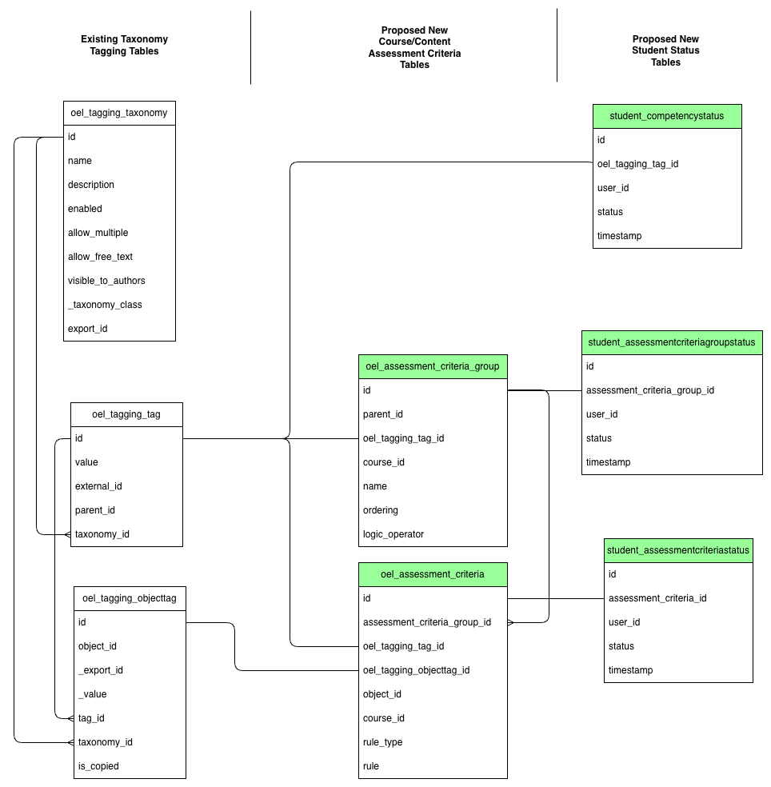

22. How should CBE assessment criteria be modeled in the database?
==================================================================

Context
-------
Competency Based Education (CBE) requires that the LMS have the ability to track learners' mastery of competencies through the means of assessment criteria. For example, in order to demonstrate that I have mastered the Multiplication competency, I need to have earned 75% or higher on Assignment 1 or Assignment 2\. The association of the competency, the threshold, the assignments, and the logical OR operator together make up the assessment criteria for the competency. Course Authors and Platform Administrators need a way to set up these associations in Studio so that their outcomes can be calculated as learners complete their materials. This is an important prerequisite for being able to display competency progress dashboards to learners and staff to make Open edX the platform of choice for those using the CBE model.

In order to support these use cases, we need to be able to model these rules (assessment criteria) and their association to the tag/competency to be demonstrated and the object (course, subsection, unit, etc) or objects that are used as the means to assess competency mastery. We also need to leave flexibility for a variety of different types as well as groupings to be able to develop a variety of pathways of different combinations of objects that can be used by learners to demonstrate mastery of a competency.

Additionally, we need to be able to track each learner's progress towards competency demonstration as they begin receiving results for their work on objects associated with the competency via assessment criteria.

Decision
--------

1. Update **`oel_tagging_taxonomy`** to have a new column for `taxonomy_type` where the value could be “Competency” or “Tag”.  
2. Add new database table for `oel_assessment_criteria_group` with these columns:  
    1. `id`: unique primary key  
    2. `parent_id`: The `oel_assessment_criteria_group.id` of the group that is the parent to this one.  
    3. `oel_tagging_tag_id`: The `oel_tagging_tag.id` of the tag that represents the competency that is mastered when the assessment criteria in this group are demonstrated.  
    4. `course_id`: The nullable `course_id` to which all of the child assessment criteria's associated objects belong.  
    5. `name`: string  
    6. `ordering`: Indicates evaluation sequence number for this criteria group. This defines the evaluation sequence for siblings and enables short-circuit evaluation.
    7. `logic_operator`: Either “AND” or “OR” or null. This determines how children are combined at a group node ("AND" or "OR").

    Example: A root group uses "OR" with two child groups.
        - Child group A (`ordering=1`) requires "AND" across Assignment 1 and Assignment 2.
        - Child group B (`ordering=2`) requires "AND" across Final Exam and viewing prerequisites.
        - If group A evaluates to true, group B is not evaluated.  
3. Add new database table for `oel_assessment_criteria` with these columns:  
    1. `id`: unique primary key  
    2. `assessment_criteria_group_id`: foreign key to Assessment Criteria Group id  
    3. `oel_tagging_objecttag_id`: Tag/Object Association id  
    4. `oel_tagging_tag_id`: The `oel_tagging_tag.id` of the tag that represents the competency that is mastered when this assessment criteria is demonstrated.  
    5. `object_id`: The `object_id` found with `oel_tagging_objecttag_id` which is included here to maximize query efficiency. It points to the course, subsection, unit, or other content that is used to assess mastery of the competency.  
    6. `course_id`: The nullable `course_id` to which the object associated with the tag belongs.  
    7. `rule_type`: “View”, “Grade”, “MasteryLevel” (Only “Grade” will be supported for now)  
    8. `rule_payload`: JSON payload keyed by `rule_type` to avoid freeform strings. Examples:  
        1. `Grade`: `{"op": "gte", "value": 75, "scale": "percent"}`  
        2. `MasteryLevel`: `{"op": "gte", "level": "Proficient"}`  
4. Add constraints and indexes to keep denormalized values aligned and queries fast.  
    1. Enforce that `oel_assessment_criteria.oel_tagging_tag_id` matches the `oel_assessment_criteria_group.oel_tagging_tag_id` for its `assessment_criteria_group_id`.  
    2. Enforce that `oel_assessment_criteria.object_id` matches the `object_id` referenced by `oel_tagging_objecttag_id`.  
    3. Add indexes for common lookups:  
        1. `oel_assessment_criteria_group(oel_tagging_tag_id, course_id)`  
        2. `oel_assessment_criteria(assessment_criteria_group_id)`  
        3. `oel_assessment_criteria(oel_tagging_objecttag_id, object_id)`  
        4. `student_assessmentcriteriastatus(user_id, assessment_criteria_id)`  
        5. `student_assessmentcriteriagroupstatus(user_id, assessment_criteria_group_id)`  
        6. `student_competencystatus(user_id, oel_tagging_tag_id)`  
5. When a completion event (graded, completed, mastered, etc.) occurs for the object, then determine and track where the learner is at in earning this competency. To reduce the number of times calculations need to run, we can have tables that hold the results at each level.  
    1. Add new database table for `student_assessmentcriteriastatus` with these columns:  
        1. `id`: unique primary key  
        2. `assessment_criteria_id`: Foreign key pointing to assessment criteria id  
        3. `user_id`: Foreign key pointing to user_id (presumably the learner's id, although it appears that it is possible for staff to get grades as well) in `auth_user` table  
        4. `status`: “Demonstrated”, “AttemptedNotDemonstrated”, “PartiallyAttempted”  
        5. `timestamp`: The timestamp at which the student's assessment criteria status was set.   
    2. Add a new database table for `student_assessmentcriteriagroupstatus` with these columns:  
        1. `id`: unique primary key  
        2. `assessment_criteria_group_id`: Foreign key pointing to assessment criteria group id  
        3. `user_id`: Foreign key pointing to user_id (presumably the learner's id, although it appears that it is possible for staff to get grades as well) in `auth_user` table  
        4. `status`: “Demonstrated”, “AttemptedNotDemonstrated”, “PartiallyAttempted”  
        5. `timestamp`: The timestamp at which the student's assessment criteria status was set.   
    3. Add a new database table for `student_competencystatus` with these columns:  
        1. `id`: unique primary key  
        2. `oel_tagging_tag_id`: Foreign key pointing to Tag id  
        3. `user_id`: Foreign key pointing to user_id (presumably the learner's id, although it appears that it is possible for staff to get grades as well) in `auth_user` table  
        4. `status`: “Demonstrated” or “PartiallyAttempted”  
        5. `timestamp`: The timestamp at which the student's competency status was set. 

Rejected Alternatives
---------------------

1. Add a generic oel\_tagging\_objecttag\_metadata table to attempt to assist with pluggable metadata concept. This table would have foreign keys to each metadata table, currently only assessment\_criteria\_group and assessment\_criteria as well as a type field to indicate what metadata table is being pointed to.  
    1. Pros  
        1. Centrally organizes metadata associations in one place  
    2. Cons  
        1. Adds additional overhead to retrieve specific metadata

.. image:: images/AssessmentCriteriaModelAlternative.png
   :alt: Assessment Criteria Model Alternative
   :width: 80%
   :align: center

2. Split rule storage into per-type tables (for example, `assessment_criteria_grade_rule` and `assessment_criteria_mastery_rule`) instead of a single JSON payload.  
    1. Pros  
        1. Provides stricter schemas and validation per rule type  
    2. Cons  
        1. Increases table count and join complexity as new rule types are added

