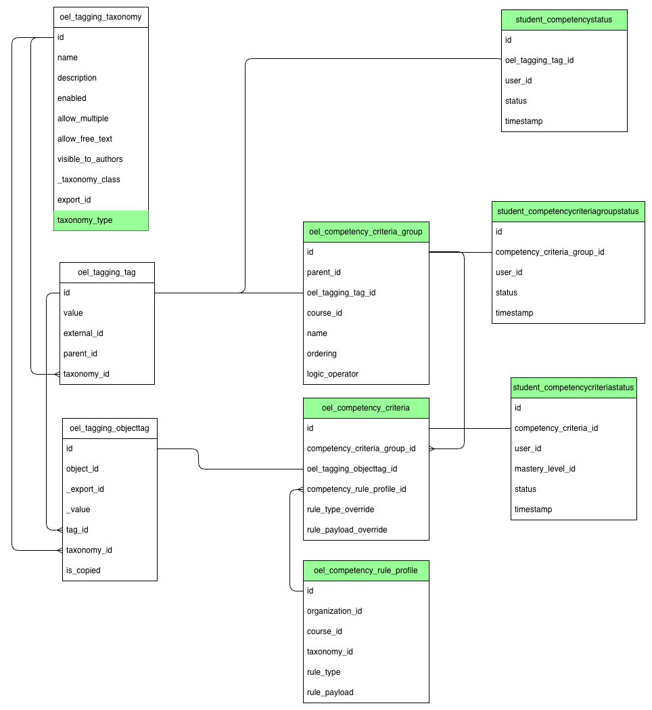

22. How should CBE competency achievement criteria be modeled in the database?
==============================================================================

Context
-------
Competency Based Education (CBE) requires that the LMS have the ability to track learners' mastery of competencies through the means of competency achievement criteria. For example, in order to demonstrate that I have mastered the Multiplication competency, I need to have earned 75% or higher on Assignment 1 or Assignment 2. The association of the competency, the threshold, the assignments, and the logical OR operator together make up the competency achievement criteria. Course Authors and Platform Administrators need a way to set up these associations in Studio so that their outcomes can be calculated as learners complete their materials. This is an important prerequisite for being able to display competency progress dashboards to learners and staff to make Open edX the platform of choice for those using the CBE model.

In order to support these use cases, we need to be able to model these rules (competency achievement criteria) and their association to the tag/competency to be demonstrated and the object (course, subsection, unit, etc) or objects that are used as the means to assess competency mastery. We also need to leave flexibility for a variety of different types as well as groupings to be able to develop a variety of pathways of different combinations of objects that can be used by learners to demonstrate mastery of a competency.

Additionally, we need to be able to track each learner's progress towards competency demonstration as they begin receiving results for their work on objects associated with the competency via competency achievement criteria.

Decision
--------

1. Update `oel_tagging_taxonomy` to have a new column for `taxonomy_type` where the value could be “Competency” or “Tag”.

   A taxonomy with a `taxonomy_type` of "Competency":

   - is able to be displayed in the UI with the competency criteria association view.
   - will be able to be displayed in the UI with the competency progress tracking view(s).
   - has constraints on its associated content objects to only be those supported for progress tracking
   - has contrainsts on its associated content objects to only include ones that could logically be used to demonstrate mastery of the competency (for example, it would not make sense to have a competency associated to both a course and a subsection assignment within that course because then there's no way to know if it's the final course grade or just that one assignment that needs to be tracked for mastery).

   In contrast, a taxonomy with a `taxonomy_type` of "Tag":

   - is only displayed in the UI with the existing Taxonomy view, not able to be displayed in the UI with the competency criteria association view.
   - is not able to be displayed in the UI with the competency progress tracking view(s).
   - has no constraints on its associated content objects, and can be associated with any course content object.

2. Add new database table for `oel_competency_criteria_group` with these columns:

   1. `id`: unique primary key
   2. `parent_id`: The `oel_competency_criteria_group.id` of the group that is the parent to this one.
   3. `oel_tagging_tag_id`: The `oel_tagging_tag.id` of the tag that represents the competency that is mastered when the competency achievement criteria in this group are demonstrated.
   4. `course_id`: The nullable `course_id` to which all of the child competency achievement criteria's associated objects belong.
   5. `name`: string
   6. `ordering`: Indicates evaluation sequence number for this criteria group. This defines the evaluation sequence for siblings and enables short-circuit evaluation.
   7. `logic_operator`: Either “AND” or “OR” or null. This determines how children are combined at a group node ("AND" or "OR").

   Example: A root group uses "OR" with two child groups.

   - Child group A (`ordering=1`) requires "AND" across Assignment 1 and Assignment 2.
   - Child group B (`ordering=2`) requires "AND" across Final Exam and viewing prerequisites.
   - If group A evaluates to true, group B is not evaluated.

3. Add new database table for `oel_competency_rule_profile` with these columns:

   1. `id`: unique primary key
   2. `organization_id`: The `organization_id` of the organization that this competency rule profile is scoped to. Null if it is not scoped to a specific organization.
   3. `course_id`: The `course_id` of the course that this competency rule profile is scoped to. Null if it is not scoped to a specific course.
   4. `taxonomy_id`: The `oel_tagging_taxonomy.id` of the taxonomy that this competency rule profile is scoped to. This should be a taxonomy with `taxonomy_type` of "Competency".
   5. `rule_type`: “View”, “Grade”, “MasteryLevel” (Only “Grade” will be supported for now)
   6. `rule_payload`: JSON payload keyed by `rule_type` to avoid freeform strings. Examples:

      1. `Grade`: `{"op": "gte", "value": 75, "scale": "percent"}`

4. Add new database table for `oel_competency_criteria` with these columns:

   1. `id`: unique primary key
   2. `competency_criteria_group_id`: foreign key to competency achievement criteria Group id
   3. `oel_tagging_objecttag_id`: Tag/Object Association id
   4. `competency_rule_profile_id`: The nullable `competency_rule_profile_id` that points to the competency rule profile that should be applied when evaluating this competency achievement criteria. If null, then the system should look for a competency rule profile scoped to the competency's taxonomy, then to the course, then to the organization, and if none is found, use a default rule.
   5. `rule_type_override`: Nullable enumerated rule type: “View”, “Grade”, “MasteryLevel” (Only “Grade” will be supported for now). When set, this overrides the `rule_type` specified in the associated `competency_rule_profile` for this specific competency achievement criteria.
   6. `rule_payload_override`: Nullable JSON payload keyed by `rule_type` to avoid freeform strings. When set, this overrides the `rule_payload` specified in the associated `competency_rule_profile` for this specific competency achievement criteria. Examples:

      1. `Grade`: `{"op": "gte", "value": 75, "scale": "percent"}`

5. Add indexes for common lookups.

   1. `oel_competency_criteria_group(oel_tagging_tag_id, course_id)`
   2. `oel_competency_criteria_group(parent_id)`
   3. `oel_tagging_objecttag(object_id)`
   4. `oel_competency_criteria(oel_tagging_objecttag_id)`
   5. `oel_competency_criteria(competency_criteria_group_id)`
   6. `student_assessmentcriteriastatus(user_id, competency_criteria_id)`
   7. `student_assessmentcriteriagroupstatus(user_id, competency_criteria_group_id)`
   8. `student_competencystatus(user_id, oel_tagging_tag_id)`
   9. `oel_competency_rule_profile(taxonomy_id, course_id, organization_id)`

6. When a completion event (graded, completed, mastered, etc.) occurs for the object, then determine and track where the learner is at in earning this competency. To reduce the number of times calculations need to run, we can have tables that hold the results at each level.

   1. Add new database table for `student_assessmentcriteriastatus` with these columns:

      1. `id`: unique primary key
      2. `competency_criteria_id`: Foreign key pointing to competency achievement criteria id
      3. `user_id`: Foreign key pointing to user_id (presumably the learner's id, although it appears that it is possible for staff to get grades as well) in `auth_user` table
      4. `status`: “Demonstrated”, “AttemptedNotDemonstrated”, “PartiallyAttempted”
      5. `timestamp`: The timestamp at which the student's competency achievement criteria status was set.
   2. Add a new database table for `student_assessmentcriteriagroupstatus` with these columns:

      1. `id`: unique primary key
      2. `competency_criteria_group_id`: Foreign key pointing to competency achievement criteria group id
      3. `user_id`: Foreign key pointing to user_id (presumably the learner's id, although it appears that it is possible for staff to get grades as well) in `auth_user` table
      4. `status`: “Demonstrated”, “AttemptedNotDemonstrated”, “PartiallyAttempted”
      5. `timestamp`: The timestamp at which the student's competency achievement criteria status was set.
   3. Add a new database table for `student_competencystatus` with these columns:

      1. `id`: unique primary key
      2. `oel_tagging_tag_id`: Foreign key pointing to Tag id
      3. `user_id`: Foreign key pointing to user_id (presumably the learner's id, although it appears that it is possible for staff to get grades as well) in `auth_user` table
      4. `status`: “Demonstrated” or “PartiallyAttempted”
      5. `timestamp`: The timestamp at which the student's competency status was set.

Example
-------
The following example illustrates how the decision model supports both defaults and overrides without requiring authors to specify every rule by hand.

Competency: "Writing Poetry" (a competency taxonomy tag)

Course: "Course X"

Content objects:

- Assignment 7: "Submit a Poem"
- Assignment 9: "Remix a Poem"

1. `oel_tagging_objecttag`:

   - Assignment 7 tagged with "Writing Poetry"
   - Assignment 9 tagged with "Writing Poetry"

2. `oel_competency_rule_profile`:

   - Course-scoped default: `Grade >= 75%` for this competency taxonomy

3. `oel_competency_criteria_group`:

   - Root group uses `OR`
   - Group A (`ordering=1`) uses `AND`
   - Group B (`ordering=2`) uses `AND`

4. `oel_competency_criteria`:

   - Group A + Assignment 7 (uses default rule profile)
   - Group A + Assignment 9 (override to `Grade >= 85%`)
   - Group B + Assignment 7 (uses default rule profile)
   - Group B + Assignment 9 (uses default rule profile)

This allows authors to set a single default rule for most tagged content, and only override where needed. It also lets the same tag/object association participate in multiple criteria groups without duplicating tagging rows.

Rejected Alternatives
---------------------

1. Same as above except combine the `oel_competency_criteria` and `oel_tagging_objecttag` tables by adding the rule information as columns on the `oel_tagging_objecttag` table. This would be a more denormalized approach that would reduce the number of joins needed to retrieve competency achievement criteria information but would add complexity to the `oel_tagging_objecttag` table and make it less flexible for other uses.

   1. Pros

      1. Reduces number of joins needed to retrieve competency achievement criteria information
      2. Single-row lookup per object tag when the competency criteria is a 1:1 mapping to a tag/object association
      3. Potentially simpler UI/API if all consumers already pivot around `objecttag` and do not need criteria grouping
   2. Cons

      1. Dilutes semantics as `objecttag` stops being a pure generic tagging junction.
      2. Many nullable columns. Most tags won't be criteria; you'll add mostly-null fields unless they're scoped with a type discriminator and partial indexes.
      3. It becomes easy to create criteria rows missing required fields (rule profile, overrides) unless enforced with a discriminator and additional constraints.
      4. It breaks or complicates criteria grouping because a single `objecttag` may need to participate in multiple criteria groups. You would need to duplicate `objecttag` rows or add another join table, which defeats the intended simplification.
      5. Down the road, permissioning differences in who can create/edit criteria vs who can create/edit generic tags would be harder to implement and audit.
      6. Performance risk if the objecttag table becomes very large and is queried for both generic tagging and competency criteria use cases with mostly-null criteria fields.
      7. Future rule types may require different fields, further bloating `objecttag` and reducing performance for non-competency use cases.

   .. image:: images/CompetencyCriteriaModelAlternative2.png
      :alt: Competency Criteria Model Alternative 2
      :width: 80%
      :align: center

2. Add a generic oel\_tagging\_objecttag\_metadata table to attempt to assist with pluggable metadata concept. This table would have foreign keys to each metadata table, currently only assessment\_criteria\_group and assessment\_criteria as well as a type field to indicate what metadata table is being pointed to.  

   1. Pros

      1. Centrally organizes metadata associations in one place
   2. Cons

      1. Adds additional overhead to retrieve specific metadata

   .. image:: images/CompetencyCriteriaModelAlternative.png
      :alt: Competency Criteria Model Alternative
      :width: 80%
      :align: center

2. Split rule storage into per-type tables (for example, `competency_criteria_grade_rule` and `competency_criteria_mastery_rule`) instead of a single JSON payload.  

   1. Pros

      1. Provides stricter schemas and validation per rule type
   2. Cons

      1. Increases table count and join complexity as new rule types are added
