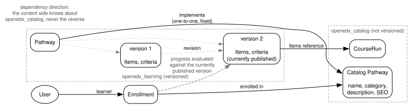

.. _openedx-learning-adr-0007:

7. Pathways: Split Between Catalog and Content
==============================================

Status
------

Draft

Context
-------

Courses in ``openedx-core`` already separate the *catalog* side (``openedx_catalog``: ``CatalogCourse``,
``CourseRun`` - what learners browse and enroll against) from the *content* side (``openedx_content`` - what is
authored, versioned, and published). Pathways have the same two aspects, and the same reasons to keep them apart:

- **Different change rates.** The display name, description shown in the catalog, and SEO metadata are revised
  frequently and casually. The definition of what a learner must do to complete the Pathway changes rarely and
  deliberately.
- **Different people doing the editing.** Catalog data is typically maintained by marketing or communications staff;
  the Pathway definition is maintained by content authors. Both are visible to learners, so the distinction is about
  who edits what, not about who can see it.
- **Different permissions follow from that.** We expect instances to want to let marketing staff update catalog
  copy without granting them the ability to change what learners must complete, and vice versa. Keeping the two
  apart makes that possible without inventing field-level permissions. However, with the new RBAC system, this
  may be less of a concern.
- **Auditability.** Progress and credentials must be judged against the definition that was in effect at the time,
  which requires versioning the definition - but versioning catalog copy would be pure overhead.

Decisions
---------

1. A Pathway is split into two parts:

   - **Catalog Pathway** - the learner-browsable, enrollable thing. It includes the display name, the description
     shown in the catalog, SEO metadata, and a **Category**. It is **not versioned**. Its definition lives in the
     ``openedx_catalog`` app.

   - **Pathway content** - the definition of the Pathway: its Items and its completion criteria. The content is
     **versioned**, so that we can always tell what the definition was at any given moment. A version of the Pathway
     content *implements* a Catalog Pathway.

2. The **Category** is a student-facing label for the kind of Pathway (e.g. "Master's Degree", "Annual Training").
   Learners see the Category rather than the word "Pathway". It is always required: rather than falling back to
   "Pathway" in code, we ship a default database entry with that name, so the behavior is uniform and operators can
   rename or extend the set without a code change.

3. In authoring contexts (Studio, Django admin, code, docs), the terminology is always "Pathway", with the Category
   shown explicitly. Relabelling is a learner-facing concern of the catalog side only.

4. **Content implementation**: The models that define pathway content are part of the ``openedx_learning`` package,
   which lives above both ``openedx_content`` and ``openedx_catalog``. This has the following consequences:

   - The implementation of the Pathway feature is mostly contained within ``openedx_learning`` rather than spread
     among ``openedx_catalog``, ``openedx_learning``, and ``openedx_content``.
   - Pathway Items/Criteria are treated as part of the Pathways feature, and are not generic content primitives
     available for use in non-pathway features.
   - Pathway Items can be implemented using ``PublishableEntity``, to get versioning and draft/publish.
   - Pathway Items may reference ``CourseRun`` entities directly.
   - Pathway Items, completion criteria, etc. cannot be used nor referenced in core ``openedx_content`` models such as
     ``Component`` (but could be referenced by a generic ``Container`` that allows any ``PublishableEntity`` as its
     child, or a specialized ``Container`` subclass defined in ``openedx_learning``, if either were useful).

5. **Enrollment** ties a learner to a Catalog Pathway. Progress is evaluated against the currently published
   content version, not against a version frozen at enrollment time, so that authoring changes reach learners who
   are already enrolled.

Example content of each model:

============================  ===================================
Catalog Pathway               Pathway content
============================  ===================================
Display name                  Pathway Items
Category                      Completion criteria
Description                   References to CourseRuns
SEO metadata
Enrollment
Link to the Pathway content
============================  ===================================

.. Run `dot -Tsvg images/pathway-catalog-content.dot > images/pathway-catalog-content.svg` to regenerate the diagram
   after making changes to `images/pathway-catalog-content.dot`.

Consequences
------------

- Catalog edits never create new content versions; definition edits (Items, criteria) always do.
- Because evaluation follows the published version rather than the enrollment-time version, edits to a Pathway apply
  to learners who are already enrolled, which is what we want, but it means edits need care and re-evaluation.
- The unversioned Catalog Pathway can be long-lived even if its content definition is changed significantly over time.

Changelog
---------

2026-09-14:

* Changed layering so that ``openedx_catalog`` depends on ``openedx_content``, not vice versa.

2026-09-01:

* Initial version
