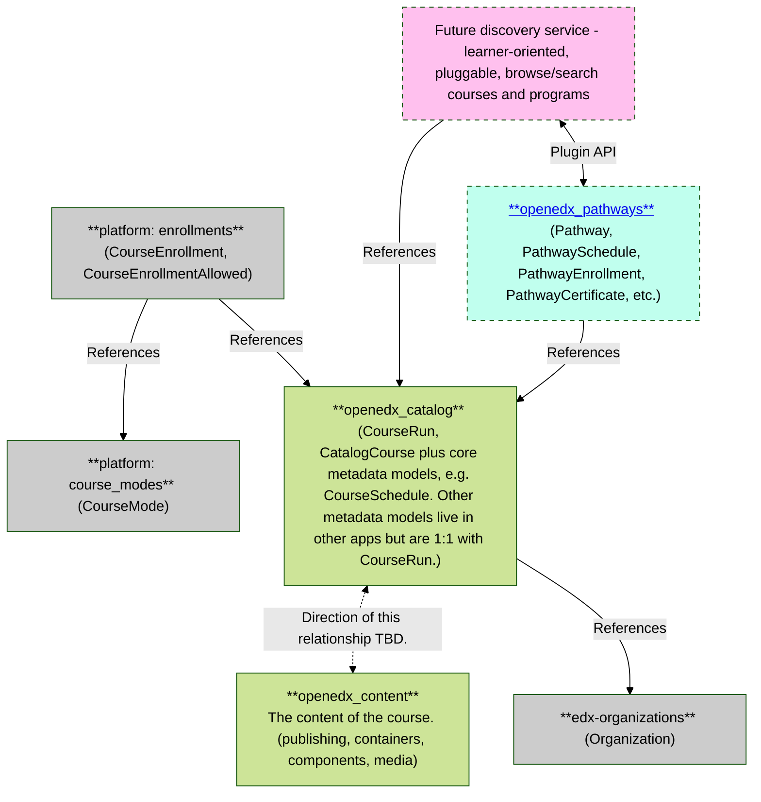

# Catalog App Architecture Diagram

Here's a visual overview of how this app relates to other apps.

(_Note: to see the diagram below, view this on GitHub or view in VS Code with [a Markdown-Mermaid extension](https://marketplace.visualstudio.com/items?itemName=bierner.markdown-mermaid) enabled._)

